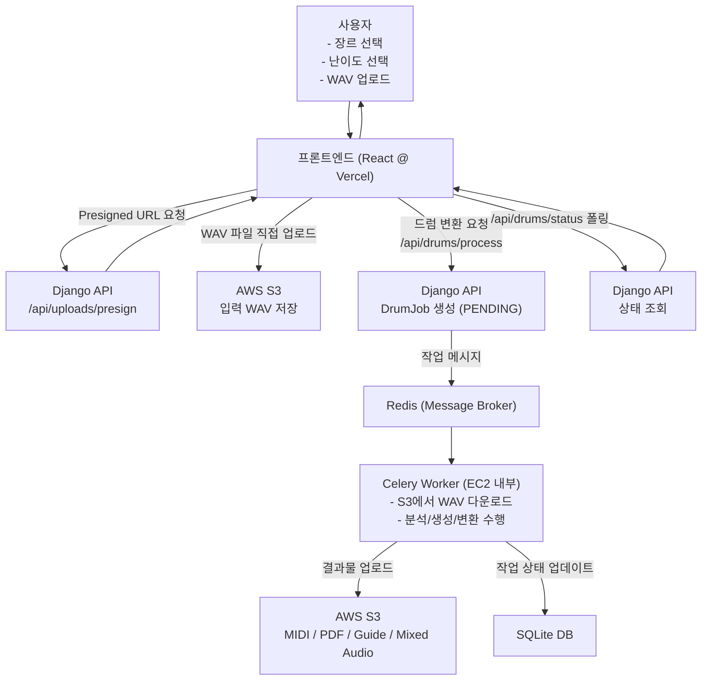

# 🎼 Easheet – AI 기반 악보 자동 생성 서비스

사용자가 업로드한 음원(WAV)을 기반으로 **드럼 악보를 자동 생성**해주는 웹 서비스입니다. 장르 선택 → 음원 업로드 → 악보 생성까지 모두 웹에서 간단히 수행할 수 있으며, 복잡한 음원 분석 및 MIDI/악보 변환 로직은 서버에서 비동기로 처리됩니다.

---

## 📌 주요 기능 (Key Features)

### ✅ 1. 장르 선택 기반 난이도/패턴 최적화

- 프론트에서 다양한 장르 카드 UI 제공 (Ballad, Jazz, Rock 등)
- 사용자의 장르 선택을 기반으로 분석 파라미터를 최적화

### ✅ 2. 음원 업로드 (S3 Presigned URL)

- 프론트가 백엔드로 **presigned URL 요청**
- 백엔드가 S3 업로드 URL 생성 후 프론트로 전달
- 프론트는 해당 URL로 음원을 안전하게 업로드

### ✅ 3. AI 기반 악기별 음원 분리 및 분석

- Demucs 기반 source separation
- Librosa 기반 beat/tempo analysis
- Drum hit detection + MIDI 생성
- Music21로 MIDI → 악보(XML) 변환
- MuseScore CLI를 사용해 PDF 악보 렌더링

### ✅ 4. 비동기 작업 진행 (Async Processing)

- Django REST API + Celery + Redis 이용
- `/process` 요청 → Celery 작업 큐 → 작업 완료 후 S3 업로드
- 작업 상태 조회 가능 (`PENDING`, `RUNNING`, `DONE`, `ERROR`)

### ✅ 5. S3 기반 결과물 다운로드

- 작업 완료 후 PDF, MIDI, XML 파일을 S3에 업로드
- 백엔드가 결과 다운로드 URL을 제공
- 사용자는 UI에서 즉시 다운로드 가능

---

## 🏗️ 시스템 아키텍처

---

## 🗂️ API Overview

### ▶ `/api/uploads/presign`

음원 업로드용 presigned URL 생성

### ▶ `/api/drums/process`

S3에 업로드된 WAV/MP3 기반으로 악보 생성 작업 시작

### ▶ `/api/drums/status/<job_id>`

비동기 작업 상태 조회

### ▶ `/api/drums/result/<job_id>`

PDF/MIDI/XML 다운로드 링크 반환

---

## ⚙️ 기술 스택

### **Frontend**

- React (Vercel 배포)
- Styled Components / CSS
- Axios
- S3 presigned URL 업로드 로직 구현

### **Backend**

- Django REST Framework
- Celery + Redis
- Demucs / Librosa / Mido
- Music21 / MuseScore
- AWS S3

### **Infra**

- AWS EC2 (Ubuntu)
- AWS S3
- Vercel (Frontend)

---

## 👥 Contributors

- 2023112497 강명수
- 2022113287 세바라
- 2022111915 이경훈
- 2023112474 이하늘
- 2022113286 페이자
- 2023112393 한수민

---

## 📑 라이선스 정보 (Library Licenses)

본 프로젝트는 다음의 오픈소스 라이브러리를 사용하며, 모두 **상업적/비상업적 이용이 자유로운 Permissive License**에 해당합니다.

### 🧩 사용 라이브러리 및 라이선스

| 라이브러리 | 라이선스 |
| --- | --- |
| **librosa** | ISC |
| **mido** | MIT |
| **demucs** | MIT |
| **soundfile** | BSD 3-Clause |

---

### 📘 라이선스별 권한 및 의무

| **License** | **무료 이용** | **배포 허용** | **소스코드 수정** | **2차적 저작물 공개 의무** | **저작권/라이선스 표기 필요** |
| --- | --- | --- | --- | --- | --- |
| **ISC** | O | O | O | X | O |
| **MIT** | O | O | O | X | O |
| **BSD 3-Clause** | O | O | O | X | O (단, 광고 금지 조항 존재) |

---

### 📚 용어 설명

| 항목 | 설명 |
| --- | --- |
| **무료 사용** | 상업적/비상업적 목적 모두 포함해 비용 없이 사용할 수 있는지 여부 |
| **배포 가능** | 라이브러리 또는 포함된 코드 전체를 다른 사람에게 재배포할 수 있는지 여부 |
| **소스코드 수정 가능** | 원본 코드를 수정·편집하거나 기능을 추가하는 것이 허용되는지 여부 |
| **2차적 저작물 공개 의무** | 수정하거나 결합해 만든 소프트웨어를 공개해야 하는지 여부 (본 프로젝트 사용 라이센스는 모두 의무 없음) |
| **저작권/라이선스 표시 필요** | 원 저작권자 이름 및 라이선스를 README 또는 배포 파일 내에 표기해야 하는지 여부 |
